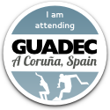

Title: GNOME Translation BoF
Date: 2012-08-01 11:51
Author: admin
Category: General
Tags: GNOME, GNOME traduccions, planet GNOME
Slug: gnome-translation-bof
Status: published

On Monday 30th [GNOME translators](http://l10n.gnome.org/people/ "GNOME rock stars translators") and members of the [GTP Coordinator team](https://live.gnome.org/TranslationProject/CoordinationTeam "GNOME Translation Coordinator Team wiki page"), meet at [GUADEC](http://guadec.org/ "GNOME's anual conference") for a BoF ([Link to raw/unprocessed/quite-not-understandable minutes](https://live.gnome.org/TranslationProject/Events/GTPBoFGUADEC2012 "Minutes from the BoF")).

Seems that [the talk](https://www.gpul.org/indico/contributionDisplay.py?contribId=43&confId=0 "Talk that I gave on GUADEC") ([slides](https://www.gpul.org/indico/materialDisplay.py?contribId=43&materialId=slides&confId=0 "Slides of the talk")) that we prepare (with [Petr](http://blogs.gnome.org/pmkovar/ "Petr Kovar's blog") and [Andre](http://blogs.gnome.org/aklapper "Andre's blog")) stirred quite a lot of discussions which were further developed during the BoF.

It was great to see everyone agreeing that our current situation is really good, but as usual, further development on [Damned-Lies](http://git.gnome.org/browse/damned-lies "Damned-Lies git repository") and [gtranslator](http://git.gnome.org/browse/gtranslator/ "gtranslator git repository") *could* bring a lot of benefits to seasoned translators, but more importantly to new translation teams that keep coming to [GNOME i18n mailing list](https://mail.gnome.org/mailman/listinfo/gnome-i18n "GNOME i18n mailing list").

**Call for action**

I said *could*, because right now both Damned-Lies and gtranslator are short in (wo)man power, so anyone with web/python/django/gtk+/c skills is welcomed to help make them better.

**Thanks**

I can not finish this blog post without giving a big thank you to everyone that came to the BoF, the Foundation Board for their [nice](https://mail.gnome.org/archives/gnome-i18n/2012-July/msg00051.html "Mail from Petr letting everyone know that the Board is inviting us to a dinner") [words](https://mail.gnome.org/archives/gnome-i18n/2012-July/msg00135.html "Mail from Petr letting everyone know that the Board is really happy with our work") and actions and everyone on GUADEC, specially the local team who made an awesome job. You all rock!

  

